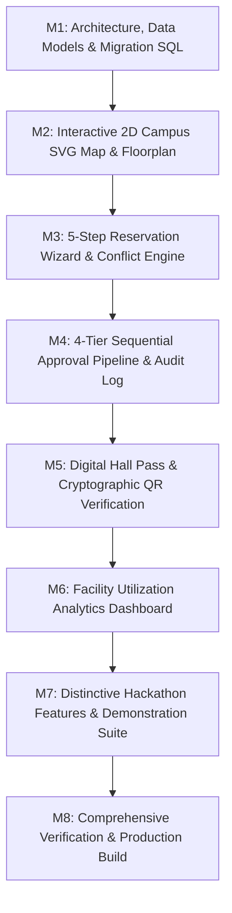

# CampusSpace: Implementation & Engineering Plan

> **Product**: CampusSpace &mdash; Campus Facility & Smart Classroom Booking System with Conflict Check  
> **Tech Stack**: Next.js 15 (App Router), TypeScript, Tailwind CSS, PostgreSQL Range Exclusion (GiST), Supabase RLS, QR Verification Engine.

---

## 1. Engineering Roadmap & Milestones

### Phase 1: Architectural Foundation & Conflict Engine
- **Data Models**: Types and schemas for Facilities, Bookings, Approvals, Hall Passes, Audit Logs, Users/Roles.
- **SQL Migrations**: `btree_gist` extension, `tstzrange` exclusion constraint, RLS policies, trigger-based audit logging.
- **Transactional State Engine**: Deterministic state machine enforcing `[)` half-open range checks, concurrency locks, and isolated demo role-switching.

### Phase 2: Core User Workspaces
- **Workspace Navigation & Design System**: Pill-shaped bubble buttons, warm off-white canvas (`#FBFBFD`), deep navy text (`#0F172A`), indigo accent (`#4F46E5`), and responsive top/drawer nav.
- **Interactive 2D Spatial Floor Plan**: SVG campus map with 12+ facilities across Main Block, East Wing, and Science Quad. Interactive pan/zoom, floor switcher (Ground, 1st, 2nd Floor), dynamic availability color badges, keyboard focusability (`tabindex`, `aria-label`).
- **Contextual Facility Drawer / Modal**: Detailed view with specs (capacity, fixed equipment, opening hours, current day schedule, direct booking trigger).

### Phase 3: Booking Journey & Conflict Prevention
- **5-Step Reservation Wizard**:
  1. *Facility Selection* (pre-filled or chosen from list).
  2. *Event & Organization Details* (Club, Department, Purpose, Expected Headcount).
  3. *Date & Time Selection* (Date picker, Start/End time selectors, half-open interval validation).
  4. *Equipment & Resource Request* (Projector, Sound System, Recording Rig, AC, etc.).
  5. *Review, Conflict Validation & Submission*.
- **Explainable Alternatives**: When an interval is taken, algorithm analyzes available facilities with capacity $\ge$ requested and equipment match, returning up to 3 immediate alternatives.

### Phase 4: Multi-Tier Approval Hierarchy & Audit Chain
- **Role Scopes**: Coding Club Requester &rarr; Secretary &rarr; Faculty Advisor &rarr; HOD &rarr; Estate Manager.
- **Stage Progression**: Requests advance strictly one step at a time. Intermediate skipping or unauthorized roles are blocked.
- **Rejection & Cancellation**: Mandatory rejection rationale; rejection or cancellation immediately releases the facility time range.
- **Audit Ledger**: Immutable event records tracking actor, previous status, new status, timestamp, and metadata.

### Phase 5: Digital Hall Pass & Physical Access Gate
- **Pass Generation**: Uniquely generated upon Estate Manager final approval with cryptographic unguessable verification token.
- **Pass Presentation**: Printable styling (`@media print`), security watermark, event details, attendee limit, and high-density SVG/Canvas QR code.
- **Security Checkpoint Scanner**: Public verification route `/verify/[token]` and manual booking reference lookup. Instant status determination: `VALID_ACTIVE`, `NOT_YET_VALID`, `EXPIRED`, `CANCELLED_REVOKED`, `INVALID_TOKEN`.

### Phase 6: Analytics & Utilization Intelligence
- **Mathematical Accuracy**: Reserved Utilization = $\frac{\sum \text{Approved Booked Hours}}{\text{Total Available Operating Hours}}$ within the reporting window.
- **Separation of Metrics**: Pending requests tracked in separate pipeline counts; no conflation with approved utilization.
- **Visual Telemetry**: Peak booking hours bar chart, facility ranking table, department allocation breakdown, and approval turnaround SLA tracker.

### Phase 7: Distinctive Hackathon Features
1. **Explainable Conflict Alternatives**: Real-time room substitution cards with explanation tags (`Capacity Match: 100%`, `Equipment: Exact Match`).
2. **Approval Transparency & SLA Tracker**: Real-time waiting duration counter, next pending approver badge, and full historical decision trail.
3. **Live Concurrency Battle Simulator**: Interactive demonstration tool showing 2 simultaneous requests targeting the same slot, visibly illustrating atomic lock victory and polite conflict mitigation.

### Phase 8: Verification & Delivery Documentation
- Automated unit and integration test suite testing all edge cases.
- Comprehensive documentation: `README.md`, `docs/RESEARCH.md`, `docs/PLANNING.md`, `docs/PROGRESS.md`, `docs/DEPLOYMENT.md`, `docs/DEFENSE_QA.md`.
- Flawless production build (`npm run build`).

---

## 2. Risk Matrix & Mitigation Strategies

| Risk | Impact | Likelihood | Mitigation Strategy |
| :--- | :---: | :---: | :--- |
| **Concurrent Double-Booking** | High | High | PostgreSQL GiST exclusion constraint on `tstzrange` at database level; atomic transactions in in-memory state engine. |
| **Skipped Governance Stages** | High | Low | State machine strictly enforces valid transitions: `secretary_review` &rarr; `faculty_review` &rarr; `hod_review` &rarr; `estate_review`. |
| **Timezone Inconsistencies** | Med | Med | Centralize all timestamps in ISO 8601 UTC in data store, rendering with explicit `Asia/Kolkata` (IST) formatting utility. |
| **Security Pass Forgery** | High | Low | QR codes encode unguessable cryptographic tokens (UUIDv4/SHA-256) resolved server-side rather than static plain text. |
| **Vercel / Demo Without Supabase** | High | High | Dual-mode architecture: seamless fallback to comprehensive in-memory transactional mock store with sample seed data. |
